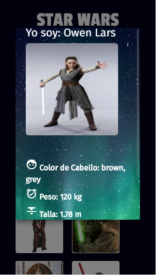
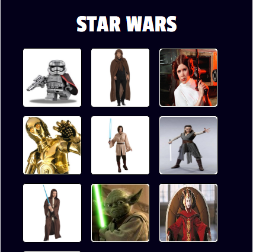

## SWAPI APP

Es una WebApp dirida a los fanaticos de Star Wars que le permite al usuario saber la información de sus personajes favoritos de la saga Star Wars.

### OBJETIVO 

EL objetivo en este reto es que mediante la API SWAPI 
(API Star Wars) crear una web app que muestre toda la informacion relacionado a los personajes de Star Wars.

### TRABAJO COLABORATIVO

> VALERIA VALLES

> YANINA MERCADO 

### HERRAMIENTAS UTILIZADAS

- PARA LA ESTRUCTURA:
    > HTML5
- PARA LOS ESTILOS :
   > CSS3 / RESPONSIVE

   > MATERIALIZE
- FUNCIONALIDAD:
   > JQUERY

   > JAVASCRIPT 

### VISTAS DE LA APLICACION

 

 

